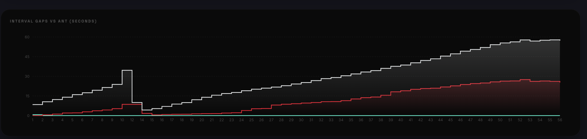
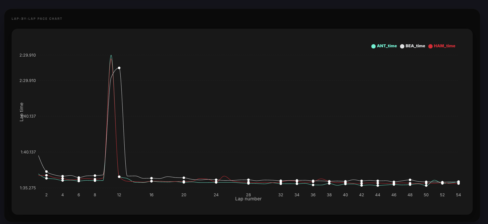
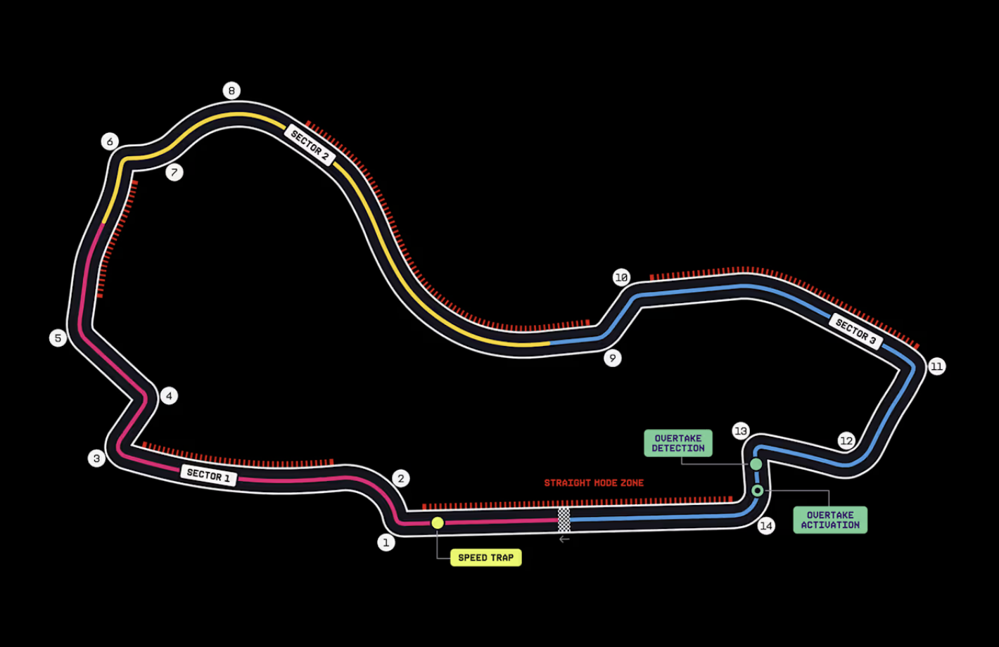
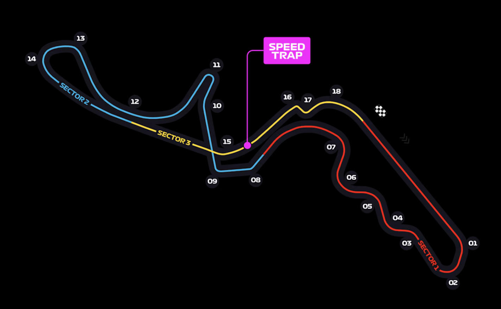
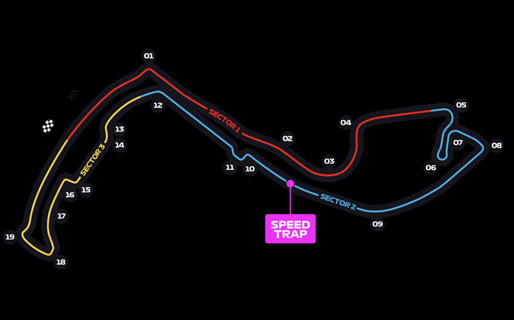

# 🏎️ GridLogic - F1 Race Analytics Dashboard

GridLogic is a comprehensive Formula 1 analytics platform that provides real-time data processing, race engineering insights, and interactive visualizations. Built with a high-performance FastAPI backend and a modern React frontend, it empowers fans and analysts with deep-dive technical data.

---

## ✨ Key Features

- **📊 Advanced Analytics**: Interactive Gap Charts and Pace Analysis using high-frequency telemetry.
- **🗺️ Interactive Track Maps**: Curated circuit maps for every Grand Prix.
- **🕒 Timing & Strategy**: Real-time lap time monitoring and pit stop strategy evaluation.
- **📡 Live Data Stream**: Integration with FastF1 for accurate session data.

---

## 📸 Project Showcase

### Technical Insights
| Gap Analysis | Performance Metrics |
| :---: | :---: |
|  |  |

### World-Class Circuits
| Australia | Japan | Monza |
| :---: | :---: | :---: |
|  |  |  |

---

## 🛠️ Technology Stack

### Backend
- **Framework**: [FastAPI](https://fastapi.tiangolo.com/) (Python 3.9+)
- **Data Engine**: [FastF1](https://github.com/theOehrly/Fast-F1), Pandas, Pydantic
- **Server**: Uvicorn

### Frontend
- **Framework**: [React 19](https://react.dev/) + [Vite](https://vitejs.dev/)
- **Styling**: Tailwind CSS, Lucide React
- **Visualization**: Recharts, Plotly.js
- **Data Fetching**: TanStack Query (React Query)

---

## 🚀 Getting Started

### Prerequisites
- Python 3.9+
- Node.js 18+

### Installation

1. **Clone the repository**
   ```bash
   git clone https://github.com/codekshitij/GridLogic.git
   cd GridLogic
   ```

2. **Setup Backend**
   ```bash
   cd backend
   python -m venv venv
   source venv/bin/activate  # macOS/Linux
   pip install -r requirements.txt
   uvicorn src.main:app --reload
   ```

3. **Setup Frontend**
   ```bash
   cd ../frontend
   npm install
   npm run dev
   ```

---

## 📁 Project Structure

```text
GridLogic/
├── backend/            # FastAPI analytics engine
│   └── src/            # Core processing logic
├── frontend/           # React dashboard
│   ├── src/            # Components & Hooks
│   └── public/         # Assets & Circuit maps
└── data.json           # Session configuration
```

---

## 📄 License

This project is for educational and analytical purposes. Formula 1 data is provided via FastF1.

